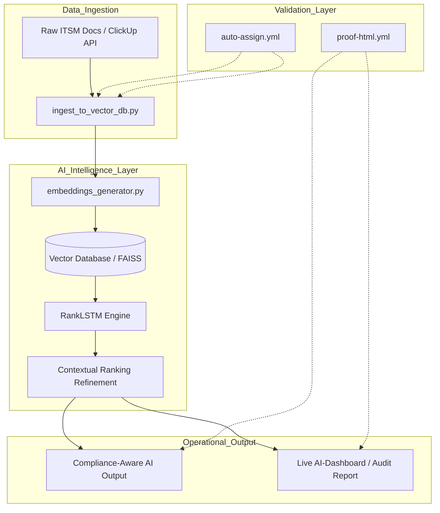

# 🛡️ AI-ITSM Compliance Auto
### Automated Compliance Workflows & AI-Powered Documentation

## 🌟 Project Mission
This project automates **ITSM documentation workflows** and **compliance auditing** using AI-driven analysis (RankLSTM) and DevSecOps orchestration. 

### 🔌 Integration & Scalability
While the current implementation features a native **ClickUp AI integration**, the core engine is **platform-agnostic**. The modular architecture allows for seamless integration with:
- **ITSM Tools:** Jira, ServiceNow, Zendesk.
- **Data Sources:** Local markdown repositories, Cloud storage, or custom APIs.
- **Compliance Frameworks:** ISO-27001, GDPR, MDR, or HIPAA.

### 🛡️ Core Capabilities
- **Automated ISO-27001 Mapping:** Automatically cross-references ITSM actions against international security standards.
- **AI Ranking Engine:** Uses RankLSTM to prioritize critical documentation updates based on compliance risk.
- **Zero-Touch Auditing:** Generate full compliance reports in seconds using the built-in orchestrator.

---

## 🏗️ Architecture Overview
The system follows a modular **RAG (Retrieval-Augmented Generation)** pattern designed for high-compliance environments:

