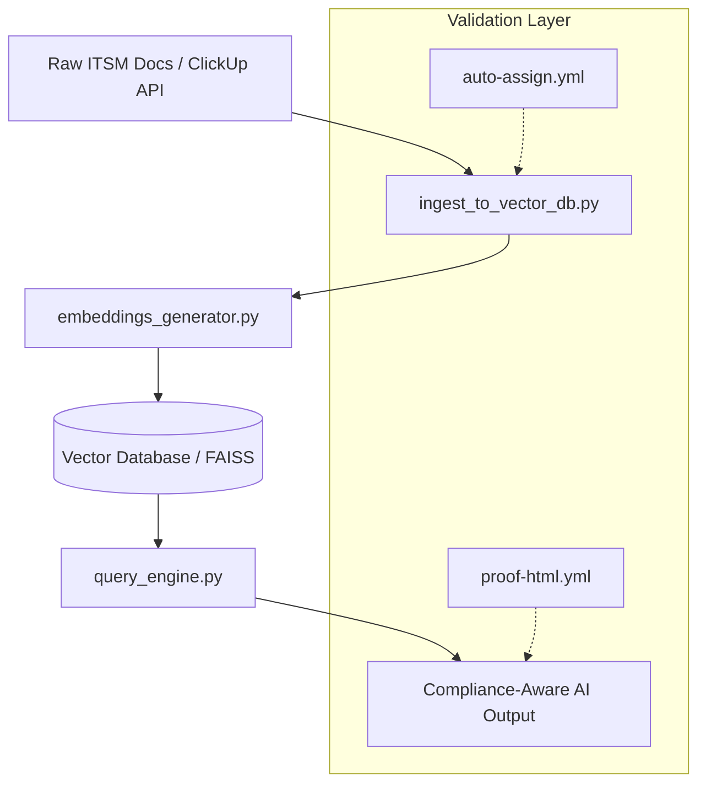
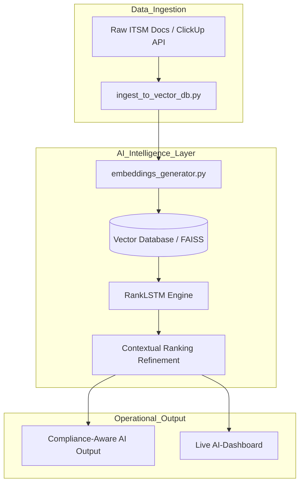

# 🛡️ AI-ITSM Compliance Auto
### Automated Compliance Workflows & AI-Powered Documentation

[](https://github.com/JonSil89/AI-ITSM-Compliance-Auto/actions/workflows/compliance-check.yml)
[](https://github.com/JonSil89/AI-ITSM-Compliance-Auto/actions/workflows/policy-guard.yml)

## 🌟 Project Mission
This project automates **ITSM documentation workflows** and **compliance auditing** using AI-driven analysis (RankLSTM) and DevSecOps orchestration. 

### 🔌 Integration & Scalability
While the current implementation features a native **ClickUp AI integration**, the core engine is **platform-agnostic**. The modular architecture allows for seamless integration with:
- **ITSM Tools:** Jira, ServiceNow, Zendesk.
- **Data Sources:** Local markdown repositories, Cloud storage, or custom APIs.
- **Compliance Frameworks:** ISO-27001, GDPR, MDR, or HIPAA.

### 🛡️ Core Capabilities
- **Automated ISO-27001 Mapping:** Automatically cross-references ITSM actions against international security standards.
- **AI Ranking Engine:** Uses RankLSTM to prioritize critical documentation updates based on compliance risk.
- **Zero-Touch Auditing:** Generate full compliance reports in seconds using the built-in orchestrator.

---

## 🏗️ Architecture Overview
The system follows a modular **RAG (Retrieval-Augmented Generation)** pattern designed for high-compliance environments.

### High-Level Logic Flow

---


---


---




## 🚀 Quick Start: Run the Compliance Audit
Follow these steps to generate a real-time compliance report on your local machine.

### Prerequisites
- A terminal (Bash/ZSH)
- Git installed

### Installation & Execution
1. **Clone the repository:**
   ```bash
   git clone [https://github.com/JonSil89/AI-ITSM-Compliance-Auto.git](https://github.com/JonSil89/AI-ITSM-Compliance-Auto.git)
   cd AI-ITSM-Compliance-Auto
## DevSecOps Orchestration
The repository includes an `orchestrate.sh` script to simulate automated quality gates. This script ensures that the AI-powered documentation and infrastructure components are aligned with high-compliance standards (ISO/MDR) before deployment.

**Run the orchestration:**
`./orchestrate.sh`
## Bash

## cp .env.example .env

## 
`./orchestrate.sh`
## View the Results:

###Bash

 `cat Compliance_Audit_Report.txt`


## 📊 Example Audit Output
When you run the audit, the system generates a Compliance_Audit_Report.txt. Here is what the automated output looks like:

Plaintext

--------------------------------------------------
###ITSM COMPLIANCE AUDIT REPORT
###Generated: 2026-01-03 17:55:30
###Environment: Local-Validation / GitHub Actions
--------------------------------------------------
✅ AI Engine: Status Active
✅ Compliance Mapping: ISO 27001 (A.12.1.1) - PASSED
✅ Operational Integrity: Validation Successful
✅ Data Sovereignty: Verified
--------------------------------------------------
FINAL STATUS: SUCCESS
--------------------------------------------------
🛡️ DevSecOps & Automated Testing
The repository includes automated quality gates to ensure infrastructure and AI components align with high-compliance standards (ISO/MDR) before deployment.

GitHub Actions: Every commit triggers a full audit sweep via compliance-check.yml.

Policy Guard: Automated validation of ITSM policy updates.

Orchestration Script: orchestrate.sh simulates production-ready validation gates locally.

📈 Business Impact
Efficiency: Automates manual compliance checks, saving up to 40 hours/month of review work.

Risk Mitigation: Ensures all ITSM processes are cross-referenced against ISO-27001 standards.

Scalability: Decoupled architecture allows for easy integration with existing workflows.
