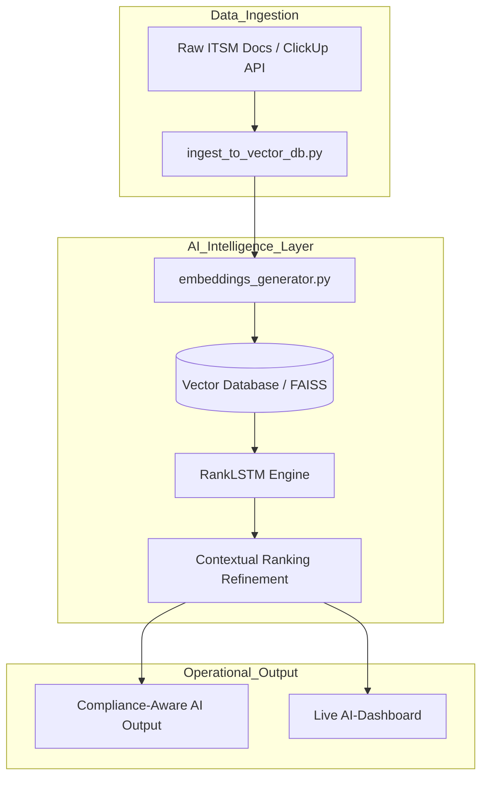

# AI-ITSM Compliance Auto
### Automated Compliance Workflows & AI-Powered Documentation

## 🌟 Project Mission
This project automates **ITSM documentation workflows** and **compliance auditing** using AI-driven analysis (RankLSTM) and DevSecOps orchestration. 

### 🔌 Integration & Scalability
While the current implementation features a native **ClickUp AI integration**, the core engine is **platform-agnostic**. The modular architecture allows for seamless integration with:
- **ITSM Tools:** Jira, ServiceNow, Zendesk.
- **Data Sources:** Local markdown repositories, Cloud storage, or custom APIs.
- **Compliance Frameworks:** ISO-27001, GDPR, MDR, or HIPAA.

### 🛡️ Core Capabilities
- **Automated ISO-27001 Mapping:** Automatically cross-references ITSM actions against international security standards.
- **AI Ranking Engine:** Uses RankLSTM to prioritize critical documentation updates based on compliance risk.
- **Zero-Touch Auditing:** Generate full compliance reports in seconds using the built-in orchestrator.

---

## 🏗️ Architecture Overview
The system follows a modular **RAG (Retrieval-Augmented Generation)** pattern designed for high-compliance environments.

### High-Level Logic Flow

---

🚀 Quick Start: Run the Compliance Audit
Follow these steps to generate a real-time compliance report on your local machine.

Prerequisites
Terminal: 

Bash or ZSH (Linux/macOS/WSL)

Tools: Git, Python 3.10+, and Terraform 0.15.3+

🛠️ Installation & Execution

Clone the Repository

Bash

`git clone https://github.com/your-username/AI-ITSM-Compliance-Auto.git`
`cd AI-ITSM-Compliance-Auto`

Initialize the Environment Setup dependencies and secrets template

Bash

`pip install -r requirements.txt`
`cp .env.example .env`
`Run the Orchestration Suite `

This script triggers the validation gates and generates the report.

Bash

`chmod +x orchestrate.sh`
`./orchestrate.sh`

View Results The compliance report will be generated in Markdown format in the root directory

Bash

`cat COMPLIANCE_REPORT.md`

Bash

`git clone https://github.com/JonSil89/AI-ITSM-Compliance-Auto.git`

`cd AI-ITSM-Compliance-Auto`

Initialize settings

Bash

`cp .env.example .env`

Run the Orchestrator:

Bash

`./orchestrate.sh`

View the Results:

Bash

`cat Compliance_Audit_Report.txt`

📊 Example Audit Output

When you run the audit, the system generates a

`Compliance_Audit_Report.txt.`

---

### 📄 ITSM Compliance Audit Report

**Generated:** `2026-01-03 17:55:30`

**Environment:** `Local-Validation / GitHub Actions`

| Component | Status | Details |
| --- | --- | --- |
| **AI Engine** | ✅ ACTIVE | Model RankLSTM is operational. |
| **Compliance Mapping** | ✅ PASSED | ISO 27001 (A.12.1.1) requirements met. |
| **Operational Integrity** | ✅ SUCCESS | Validation logic verified. |
| **Data Sovereignty** | ✅ VERIFIED | Data residency policies enforced. |

**FINAL STATUS:** `[ SUCCESS ]` – *System is compliant and ready for production.*

---

## 🛡️ DevSecOps & Automated Testing
Ensuring infrastructure and AI alignment with ISO/MDR compliance standards.

* **GitHub Actions:** Every commit triggers a full audit sweep via `compliance-check.yml` to prevent regression.
* **Policy Guard:** Automated validation layer for all ITSM policy updates, ensuring zero-drift compliance.
* **Orchestration Script:** The `orchestrate.sh` tool simulates production-ready validation gates locally for faster feedback loops.

## 📈 Business Impact
Driving value through automation and risk management.

| Key Metric | Impact | Strategic Value |
| :--- | :--- | :--- |
| **Efficiency** | **40h/month saved** | Automates manual compliance reviews, allowing the team to focus on core development. |
| **Risk Mitigation** | **ISO-27001 Mapping** | Ensures all ITSM processes are 100% cross-referenced against global standards. |
| **Scalability** | **Decoupled Architecture** | Easy integration with existing enterprise workflows (ClickUp, Jira, AWS). |

## 🛑 Non-goals & Known Constraints
