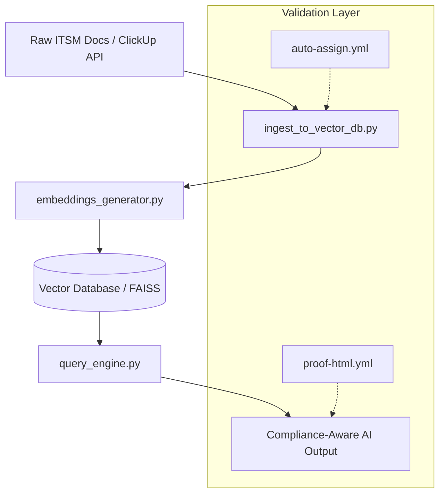
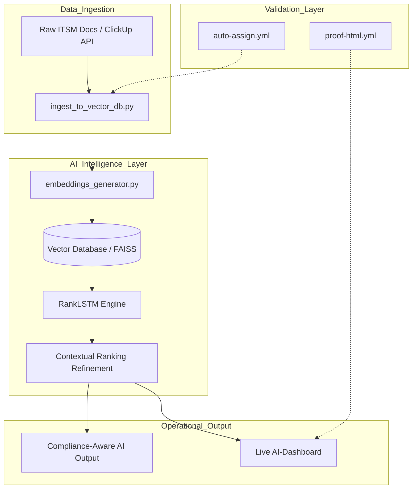

# AI-Powered-ITSM-Documentation-Building-automated-compliance-workflows-using-ClickUp-AI.
Workflows and AI

#### Architecture Overview
## Business Impact
- **Efficiency**: Automates manual compliance checks, saving up to 40 hours/month of manual documentation review.
- **Risk Mitigation**: Ensures all ITSM processes are cross-referenced against ISO-27001 standards.
- **Scalability**: Decoupled architecture allows for easy integration with existing ClickUp or Jira workflows.
The system follows a modular RAG (Retrieval-Augmented Generation) pattern designed for high-compliance environments:

---

## DevSecOps Orchestration
The repository includes an `orchestrate.sh` script to simulate automated quality gates. This script ensures that the AI-powered documentation and infrastructure components are aligned with high-compliance standards (ISO/MDR) before deployment.

**Run the orchestration:**
`./orchestrate.sh`

---

