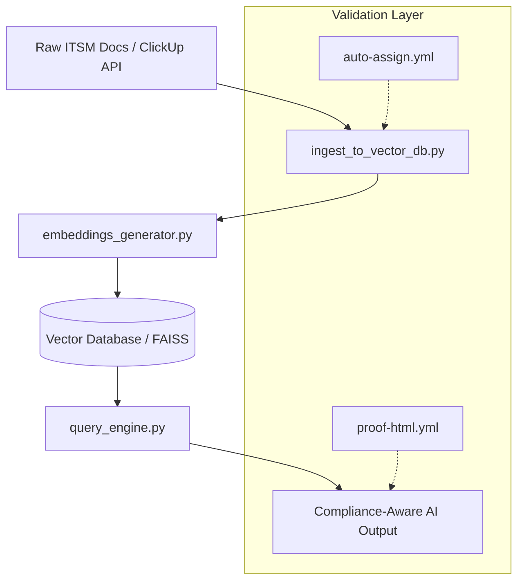
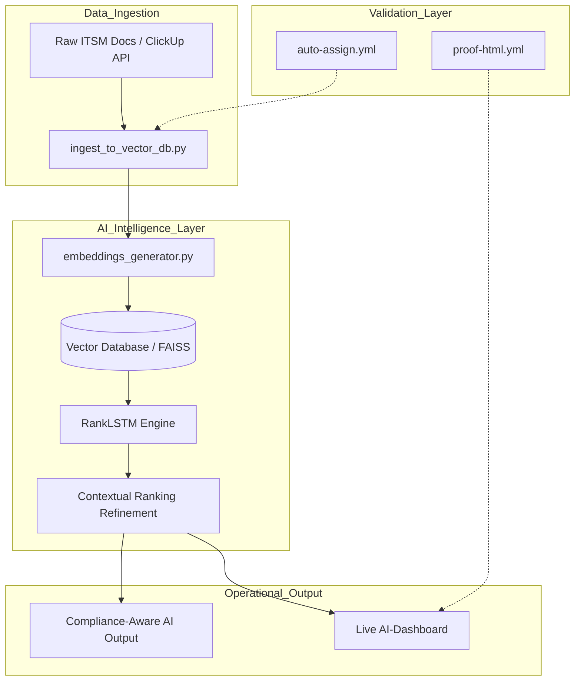

# 🛡️ AI-ITSM Compliance Auto
### Automated Compliance Workflows & AI-Powered Documentation

[](https://github.com/JonSil89/AI-ITSM-Compliance-Auto/actions/workflows/compliance-check.yml)
[](https://github.com/JonSil89/AI-ITSM-Compliance-Auto/actions/workflows/policy-guard.yml)

## 🌟 Project Mission
This project automates **ITSM documentation workflows** and **compliance auditing** using AI-driven analysis (RankLSTM) and DevSecOps orchestration. 

### 🔌 Integration & Scalability
While the current implementation features a native **ClickUp AI integration**, the core engine is **platform-agnostic**. The modular architecture allows for seamless integration with:
- **ITSM Tools:** Jira, ServiceNow, Zendesk.
- **Data Sources:** Local markdown repositories, Cloud storage, or custom APIs.
- **Compliance Frameworks:** Easily adaptable for ISO-27001, GDPR, MDR, or HIPAA.

### 🛡️ Core Capabilities
- **Automated ISO-27001 Mapping:** Automatically cross-references ITSM actions against international security standards.
- **AI Ranking Engine:** Uses RankLSTM to prioritize critical documentation updates based on compliance risk.
- **Zero-Touch Auditing:** Generate full compliance reports in seconds using the built-in orchestrator.

---


---
## Quick Start: Run the Compliance Audit
Follow these steps to generate a real-time compliance report on your local machine. Generate a real-time compliance report on your local machine in seconds.

## DevSecOps Orchestration
The repository includes an `orchestrate.sh` script to simulate automated quality gates. This script ensures that the AI-powered documentation and infrastructure components are aligned with high-compliance standards (ISO/MDR) before deployment.

**Run the orchestration:**
`./orchestrate.sh`

### Prerequisites
- A terminal (Bash/ZSH)
- Git installed

### Installation & Execution
1. **Clone the repository:**
   ```bash
   git clone [https://github.com/JonSil89/AI-ITSM-Compliance-Auto.git](https://github.com/JonSil89/AI-ITSM-Compliance-Auto.git)
   cd AI-ITSM-Compliance-Auto

**Run the orchestration:**
`./orchestrate.sh`



